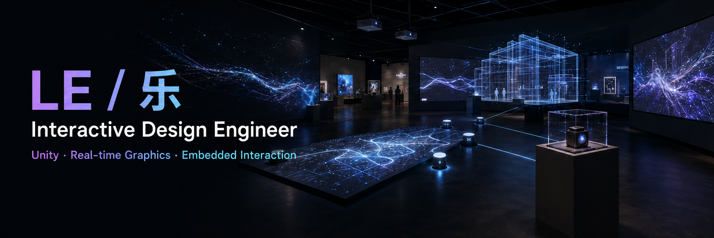
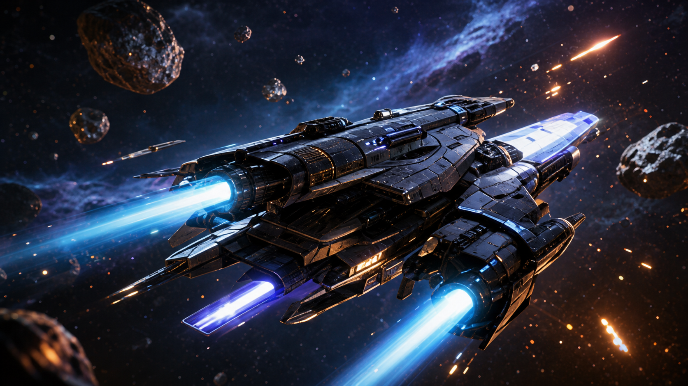
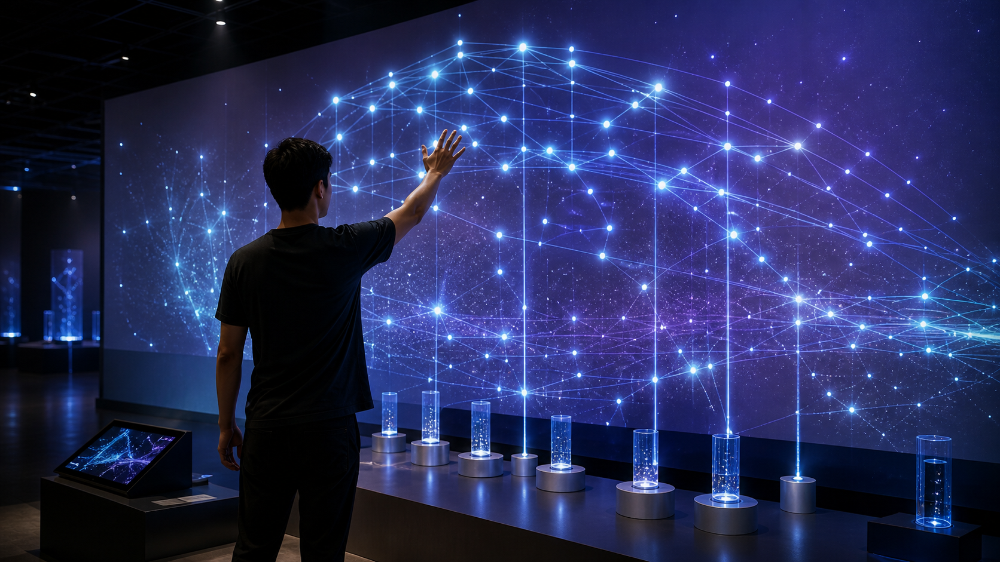

  

  I design and build interactive experiences that connect people, spaces, devices, and data. 
  From real-time visuals to embedded systems, I turn complex ideas into responsive, meaningful interactions.

  
  
  
  
  

  
  
  

<table>
  <tr>
    <td width="25%" valign="top">
      <h3>About</h3>
      
I'm an Interactive Design Engineer at <strong>Dafeng Digital Arts</strong>, with a cross-disciplinary background in programming, real-time graphics, devices, and spatial interaction.

    </td>
    <td width="25%" valign="top">
      <h3>◇ Interactive Exhibition</h3>
      
Design and develop engaging exhibition and cultural-tourism installations that respond to people and environments in real time.

    </td>
    <td width="25%" valign="top">
      <h3>△ Real-time Graphics</h3>
      
Create high-performance visuals and immersive effects with Unity, shaders, VFX Graph, HDRP, and URP.

    </td>
    <td width="25%" valign="top">
      <h3>▣ Embedded & Connected</h3>
      
Integrate sensors, controllers, physical devices, and network protocols into reliable interactive systems.

    </td>
  </tr>
</table>

  
  
  
  
  
  
  
  
  
  
  
  

---

## Selected Work

<table>
  <tr>
    <td width="50%" valign="top">
      
      <h3><a href="https://github.com/lelehappy666/SpaceshipDemo">Real-time VFX: Ship Demo</a></h3>
      
Real-time rendering, custom shaders, and GPU particles in Unity HDRP.

      
  

    </td>
    <td width="50%" valign="top">
      
      <h3>Exhibition Interaction System</h3>
      
Multi-sensor interaction systems that connect real-time visuals, spatial input, and physical devices.

      
   

    </td>
  </tr>
</table>

## Selected Repositories

| Project | Focus | Stack |
| --- | --- | --- |
| [VisualEffectGraph-Samples](https://github.com/lelehappy666/VisualEffectGraph-Samples) | Visual Effect Graph sample scenes and effects | C#, ShaderLab, HLSL |
| [VfxGraphTestbed](https://github.com/lelehappy666/VfxGraphTestbed) | Rapid VFX prototyping and experiments | HLSL, VFX Graph |
| [Smrvfx](https://github.com/lelehappy666/Smrvfx) | Animated skinned mesh as a particle source | C#, VFX Graph |
| [xNode](https://github.com/lelehappy666/xNode) | Node-graph framework | C# |
| [xLua](https://github.com/lelehappy666/xLua) | Lua integration | C#, Lua |
| [Odin Serializer](https://github.com/lelehappy666/odin-serializer) | Serialization framework | C# |

## 🧭 Experience / 职业经历

| Period | Company | Role / Focus |
| --- | --- | --- |
| **Jun 2026 – Present** | **Dafeng Digital Arts (Dafeng Group)** | Interactive Design Engineer |
| Apr 2025 – Mar 2026 | **SYC｜浙江世源创建设发展有限公司** | Unity Interactive Developer |
| Mar 2022 – Apr 2025 | **ShaderBox** | Unity / C# Developer |
| Jan 2019 – Mar 2022 | **Z-spaxis** | Unity / C# Developer |

---

## 📊 GitHub Overview

<table align="center">
  <tr>
    <td width="50%" valign="top">
      
    </td>
    <td width="50%" valign="top">
      
    </td>
  </tr>
  <tr>
    <td width="50%" valign="top">
      
    </td>
    <td width="50%" valign="top">
      
    </td>
  </tr>
</table>

## 🏆 GitHub Trophies

  

---

  Building interactions that connect digital content, physical devices, and real-world spaces.

